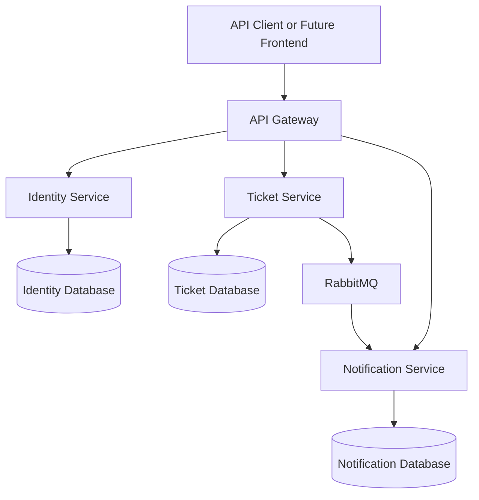
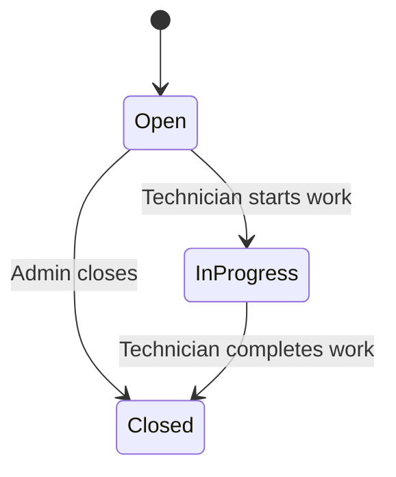

# Help Desk Microservices Backend

## Detailed Development Plan, Current Progress, and Remaining Work

## 1. Executive Summary

This document explains the backend system we are building, the decisions already made, the completed work, and the implementation path for the remaining features.

The project is a Help Desk ticketing system built with a microservices architecture. The first version is intentionally small and practical. Its purpose is to establish a clean, working foundation without introducing unnecessary complexity too early.

Phase one focuses on three business capabilities:

1. User identity and role management.
2. Help desk ticket management.
3. Notifications generated from ticket events.

The backend uses .NET 10, ASP.NET Core Web API, Entity Framework Core, PostgreSQL, Docker, JWT authentication, and eventually RabbitMQ.

Each microservice is a separate Web API project and owns its own database. We are deliberately not dividing every service into separate API, Domain, Application, and Infrastructure projects. That style can be useful in large systems, but it adds too much structure for this learning-focused first phase. Instead, each service remains easy to navigate through folders such as `Models`, `Dtos`, `Services`, `Repositories`, and `Data`.

The code should remain readable, explicit, and easy to explain. Architectural patterns are used only where they solve a real problem. Ticket Service uses Repository and Unit of Work because it performs normal application data operations. Identity Service relies on ASP.NET Core Identity's `UserManager` and `RoleManager`, because wrapping those APIs with another repository layer would provide little value.

---

## 2. Phase One Objectives

The objective of phase one is to support the complete basic ticket lifecycle.

An employee should be able to:

- Register an account.
- Log in and receive a JWT access token.
- View their own account information.
- Create a support ticket.
- View only tickets they created.
- Update an eligible ticket when business rules allow it.
- View comments and status history related to their tickets.

A technician should be able to:

- Log in using an account whose role was assigned by an administrator.
- View tickets assigned to them.
- Move an assigned ticket through permitted statuses.
- Add comments to an assigned ticket.
- Close a completed ticket.

An administrator should be able to:

- View users.
- Assign the `Employee` or `Technician` role.
- View all tickets.
- Manage tickets when administrative access is required.
- Monitor basic system operation.

The system should also:

- Automatically select the technician with the fewest active tickets.
- Leave a ticket unassigned when no eligible technician exists.
- Preserve a history of important ticket changes.
- Publish important events to RabbitMQ.
- Create notification records in Notification Service.

---

## 3. Agreed Scope and Simplification Rules

### Included in phase one

- Backend APIs only.
- Identity Service.
- Ticket Service.
- Notification Service.
- Shared integration event contracts.
- API Gateway after the core services work independently.
- PostgreSQL database per service.
- JWT authentication and role authorization.
- Repository and Unit of Work where they provide clear value.
- Basic ticket comments and activity history.
- Simple automatic technician assignment.
- RabbitMQ integration.
- Basic tests, health checks, and Docker support.

### Deferred to a later phase

- Frontend applications.
- Organization Service.
- Departments, teams, and organization hierarchy.
- Technician schedules and advanced availability rules.
- Skill-based or category-based assignment.
- Manual reassignment and rejection workflows.
- User activation and deactivation management endpoints.
- Advanced dashboards and analytics.
- Refresh tokens.
- Forgot-password and email verification flows.
- Email, SMS, or push delivery providers.
- File attachments.
- SLA management and escalation rules.

Deferring these features is intentional. Phase one should first prove the core business flow and the boundaries between services.

---

## 4. High-Level Architecture

The planned backend contains the following projects:

```text
HelpDeskMicroservices
|
|-- src
|   |-- Services
|   |   |-- IdentityService
|   |   |-- TicketService
|   |   `-- NotificationService
|   |-- Shared
|   |   `-- IntegrationContracts
|   `-- Gateway
|       `-- ApiGateway
|-- tests
|   |-- IdentityService.Tests
|   |-- TicketService.Tests
|   `-- NotificationService.Tests
|-- docker-compose.yml
`-- HelpDeskMicroservices.sln
```

The gateway will eventually become the public entry point. Internally, every service remains independently deployable and maintains ownership of its own data.



RabbitMQ is used for asynchronous business events, not ordinary request-response operations. For example, Ticket Service can publish `TicketCreated` without waiting for Notification Service to finish processing it.

---

## 5. Service Responsibilities and Data Ownership

| Component | Main responsibility | Owns | Must not own |
|---|---|---|---|
| Identity Service | Authentication, users, roles, JWT creation | Users, passwords, roles, identity data | Tickets and notifications |
| Ticket Service | Ticket lifecycle and ticket business rules | Tickets, comments, activity history | User passwords or Identity tables |
| Notification Service | Notification records created from events | Notifications and processing state | Ticket records or user credentials |
| IntegrationContracts | Shared message definitions | Event contract classes only | Business logic, database code, service models |
| API Gateway | Routing and one public backend address | Routing configuration | Business data and domain rules |

The most important microservices rule is database ownership. Ticket Service must never query Identity Service's PostgreSQL tables directly. If Ticket Service needs technician information, it must request it through an internal Identity Service API or receive it through events.

This prevents hidden coupling. Identity Service remains free to change its database structure without breaking Ticket Service.

---

## 6. Internal Folder Structure

Each service remains a single Web API project. A typical service structure is:

```text
TicketService
|
|-- Controllers
|-- Data
|-- Dtos
|-- Enums
|-- Models
|-- Repositories
|-- Services
|-- Migrations
|-- Program.cs
|-- appsettings.json
`-- TicketService.csproj
```

- `Controllers`: HTTP endpoints and status-code handling.
- `Data`: Entity Framework `DbContext`, database configuration, and Unit of Work.
- `Dtos`: Request and response shapes exposed by the API.
- `Enums`: Fixed business values such as ticket status and priority.
- `Models`: Database entities.
- `Repositories`: Database access queries.
- `Services`: Business rules and use-case coordination.
- `Migrations`: Entity Framework database migration files.

Controllers should stay thin. A controller validates the HTTP request, calls a service, and returns the correct response. Business decisions belong in the service layer, while database query details belong in repositories.

---

## 7. Roles and Authorization Rules

| Role | Meaning | Main permissions |
|---|---|---|
| Employee | A normal user requesting help | Register, create tickets, and view their own tickets |
| Technician | A support worker resolving tickets | View assigned tickets, comment, change status, and close assigned work |
| Admin | System administrator | View users, assign roles, and access all tickets |

### Account creation rule

A user registers independently. The new account receives the `Employee` role by default. An administrator later changes the role to `Technician` when appropriate.

This prevents a public registration request from selecting a privileged role. The client must never be trusted to submit `Admin` or `Technician` during registration.

### Authentication and authorization

Authentication answers: **Who is the caller?**

Authorization answers: **What is that caller allowed to do?**

A valid JWT proves the user's identity, but the API must still apply ownership and role checks. One employee must not be allowed to read another employee's ticket simply by guessing its identifier.

---

## 8. Current Ticket Domain Model

| Field | Purpose |
|---|---|
| `Id` | Unique ticket identifier |
| `Title` | Short summary of the problem |
| `Description` | Detailed explanation of the problem |
| `Type` | General ticket type |
| `Category` | Classification such as hardware or software |
| `Priority` | Urgency level |
| `Status` | Current lifecycle state |
| `CreatedByUserId` | Identity Service user ID of the employee who created it |
| `AssignedTechnicianId` | Identity Service user ID of the assigned technician; nullable |
| `CreatedAt` | Creation timestamp in UTC |
| `UpdatedAt` | Last modification timestamp in UTC; nullable until updated |
| `ClosedAt` | Closing timestamp in UTC; nullable until closed |

`CreatedByUserId` and `AssignedTechnicianId` are external user identifiers. They are not Entity Framework foreign keys to Identity Service because Ticket Service has a separate database.

### Ticket status

- `Open`: The ticket exists and still requires work.
- `InProgress`: A technician is actively working on it.
- `Closed`: The work has been completed.

For phase one, `Open` and `InProgress` count as active tickets. `Closed` does not count toward a technician's active workload.

---

## 9. Completed Work

### 9.1 Solution foundation

The `IdentityService`, `TicketService`, `NotificationService`, and `IntegrationContracts` projects have been created. The solution restores and builds successfully. The `Microsoft.OpenApi` vulnerability warning was resolved by moving to a safe package version, and the vulnerability scan completed without reporting vulnerable packages.

### 9.2 Docker and PostgreSQL

Docker Compose has separate PostgreSQL containers:

- Identity database on host port `5433`.
- Ticket database on host port `5434`.

Separate ports allow both databases to run locally at the same time. Named volumes preserve database data when containers are normally stopped or recreated.

### 9.3 Identity Service

Completed and verified:

- `ApplicationUser` uses a `Guid` identifier.
- `IdentityDbContext` uses PostgreSQL.
- Entity Framework migrations were created and applied.
- Standard Identity tables exist.
- `Employee`, `Technician`, and `Admin` roles are seeded.
- An initial Admin account can be created from development secrets.
- Public registration creates an Employee account.
- Login validates credentials and creates a JWT.
- JWT authentication is configured.
- Role information is included in the token.
- `GET /api/users/me` returns the authenticated profile.
- Admin endpoints list users and change a user's basic role.

### 9.4 Ticket Service foundation

Ticket Service now has:

- Ticket model and enums.
- `TicketDbContext` and PostgreSQL configuration.
- Entity Framework migration and database table.
- Ticket repository.
- Unit of Work.
- JWT authentication and role authorization.

### 9.5 Ticket creation

The create-ticket endpoint has been tested successfully:

- `CreatedByUserId` is read from the JWT, not the body.
- New tickets start as `Open`.
- Time is generated by the server in UTC.
- A ticket may initially remain unassigned.
- The response is `201 Created`.

Reading the creator ID from the JWT prevents a caller from creating a ticket under another user's identity.

### 9.6 Ticket queries

Get-all and get-by-ID operations are implemented and verified with `200 OK`.

- Employee: sees tickets they created.
- Technician: sees tickets assigned to them.
- Admin: sees all tickets.

---

## 10. How the Current Request Flows Work

### 10.1 Registration and login

1. A user submits registration information to Identity Service.
2. Identity Service validates the input.
3. `UserManager` hashes the password and creates the user.
4. Identity Service assigns the Employee role.
5. The user later submits email and password to login.
6. Identity Service checks the credentials.
7. A JWT is created with claims such as user ID, email, and role.
8. The client sends it as `Authorization: Bearer <token>`.
9. Ticket Service validates the token using the issuer, audience, signing key, and expiration rules.

Identity Service creates the token, but Ticket Service does not need to call Identity Service for every request. It validates the signed token locally.

### 10.2 Create ticket

1. The employee sends a request with a Bearer token.
2. JWT middleware validates the token.
3. The controller receives the request DTO.
4. The service extracts the user ID from validated claims.
5. The service creates a Ticket entity with server-controlled values.
6. The repository adds it to Entity Framework tracking.
7. Unit of Work calls `SaveChangesAsync` once.
8. PostgreSQL commits the ticket.
9. The entity is mapped to a response DTO.
10. The API returns `201 Created`.

Automatic technician selection will later occur before the Unit of Work commit.

---

## 11. Repository and Unit of Work

### Repository

The repository keeps Entity Framework queries out of the service layer. It provides meaningful data operations such as getting a ticket by ID, filtering tickets by employee or technician, adding and updating tickets, and counting a technician's active tickets.

The repository controls **how data is accessed**.

### Unit of Work

Unit of Work controls when tracked changes are committed. A future close-ticket operation may need to:

1. Change the status.
2. Set `ClosedAt`.
3. Add an activity-history record.
4. Save everything in one transaction.

If the commit fails, none of these changes should be partially stored. Unit of Work gives the business operation one clear transaction boundary.

### Why Identity Service is different

ASP.NET Core Identity already supplies `UserManager`, `RoleManager`, and specialized stores. Wrapping them in generic repositories would add code without making identity operations clearer, so Identity Service uses these framework APIs directly.

---

## 12. Current Endpoint Status

Exact route names can still be adjusted, but the functional status is:

| Capability | Service | Access | Status |
|---|---|---|---|
| Register | Identity | Public | Implemented and verified |
| Login | Identity | Public | Implemented and verified |
| View current user | Identity | Authenticated | Implemented and verified |
| List users | Identity | Admin | Implemented and verified |
| Change user role | Identity | Admin | Implemented and verified |
| Create ticket | Ticket | Authorized role | Implemented and verified |
| Get visible tickets | Ticket | Authenticated | Implemented and verified |
| Get ticket by ID | Ticket | Owner, assignee, or Admin | Implemented and verified |
| Update ticket | Ticket | Role and ownership based | Code prepared; endpoint testing remains |
| Delete ticket | Ticket | Restricted | Code prepared; endpoint testing remains |
| Change ticket status | Ticket | Technician/Admin | Not yet completed |
| Add comment | Ticket | Authorized participant | Not yet implemented |
| Automatic assignment | Ticket + Identity | Internal behavior | Not yet implemented |
| Create notification from event | Notification | RabbitMQ consumer | Not yet implemented |

Code that exists is not considered complete until both successful and failed API cases have been verified.

---

## 13. Remaining Implementation Plan

### Phase A: Complete and verify the basic Ticket API

Work:

- Finish and test update and delete.
- Ensure responses include `UpdatedAt` and `ClosedAt`.
- Apply role and ownership checks consistently.
- Test valid and invalid requests.

Recommended rules:

- A general update DTO must not accept assignee, creator, status, or timestamps.
- An employee may edit normal details only while their ticket is `Open`.
- A technician cannot edit another technician's assigned ticket.
- Delete should initially be Admin-only because that is the safest simple rule.

Acceptance criteria:

- Valid update returns `200 OK`.
- Missing ticket returns `404 Not Found`.
- Unauthorized access returns `403 Forbidden` or the chosen safe `404` policy.
- Invalid DTO returns `400 Bad Request`.
- Valid deletion returns `204 No Content`.
- The deleted ticket can no longer be queried.

### Phase B: Controlled status transitions

Status should change through a dedicated endpoint rather than the general update endpoint.



Reopening closed tickets is deferred because it introduces additional workload, audit, and notification rules.

Required implementation:

- `ChangeTicketStatusRequest` DTO.
- Validation of allowed transitions.
- Technician ownership check.
- Update `UpdatedAt` on every change.
- Set `ClosedAt` only on closing.
- Create an activity-history entry.

### Phase C: Ticket comments

Suggested Comment fields:

- `Id`
- `TicketId`
- `AuthorUserId`
- `Content`
- `CreatedAt`

Rules:

- The ticket creator, assigned technician, and Admin may comment.
- Unrelated users cannot read or add comments.
- Content is required and length-limited.
- `AuthorUserId` always comes from the JWT.

Endpoints:

- `POST /api/tickets/{ticketId}/comments`
- `GET /api/tickets/{ticketId}/comments`

### Phase D: Ticket activity history

Activity history is an audit trail, while comments are conversation.

Suggested fields:

- `Id`
- `TicketId`
- `PerformedByUserId`
- `ActivityType`
- `OldValue`
- `NewValue`
- `CreatedAt`

Examples include ticket creation, technician assignment, status changes, priority changes, and closure. History must be committed in the same local database transaction as the ticket change.

### Phase E: Automatic technician assignment

The agreed rule is:

> Assign the ticket to the eligible technician with the fewest active tickets. If no technician is eligible, create it without an assignment.

Identity Service will expose a small internal endpoint returning only eligible technician IDs and display names. It must not expose passwords, security stamps, or unnecessary identity data.

If `IsActive` exists, eligibility can require it to be true, while Admin activation/deactivation endpoints remain deferred. New users can remain active by default in phase one.

Algorithm:

1. Request eligible technicians from Identity Service.
2. If none exist, leave `AssignedTechnicianId` as `null`.
3. Count each technician's `Open` and `InProgress` tickets in Ticket Service.
4. Choose the lowest count.
5. Apply a stable tie-breaker, such as user ID ordering.
6. Save the selected ID with the ticket.
7. Record the assignment in activity history.

Ticket Service calculates workload because it owns ticket status data.

Two simultaneous requests could temporarily choose the same technician. That small imbalance is acceptable in phase one. More advanced locking or queue-based assignment can be added later.

If Identity Service is unavailable, the first version should preserve the employee's request by creating the ticket unassigned and logging the failure. A later worker can retry assignment.

### Phase F: IntegrationContracts

`IntegrationContracts` shares the structure of messages exchanged between services.

Initial contracts:

- `TicketCreatedIntegrationEvent`
- `TicketAssignedIntegrationEvent`
- `TicketStatusChangedIntegrationEvent`
- `TicketClosedIntegrationEvent`
- `TicketCommentAddedIntegrationEvent`

Example:

```csharp
public sealed record TicketCreatedIntegrationEvent(
    Guid EventId,
    Guid TicketId,
    Guid CreatedByUserId,
    Guid? AssignedTechnicianId,
    string Title,
    DateTime OccurredAtUtc);
```

Contracts contain message data, not Ticket Service's Entity Framework entities. The project must never contain controllers, repositories, database contexts, or business logic.

### Phase G: RabbitMQ publishing

Initial flow:

1. Ticket Service completes a business operation.
2. It publishes an integration event.
3. RabbitMQ routes the message.
4. Notification Service receives it.
5. Notification Service stores a notification.
6. The message is acknowledged only after successful processing.

Directly publishing after `SaveChangesAsync` creates a consistency risk: the database may commit while publishing fails. The robust solution is the Outbox pattern:

- Save the ticket change and an Outbox event in one PostgreSQL transaction.
- A background worker publishes pending Outbox events.
- Mark an event processed only after RabbitMQ confirms publication.

We may first implement a simple publisher to understand the flow, then add the Outbox during reliability hardening.

### Phase H: Notification Service

Phase one stores in-application notifications and does not send email or SMS.

Suggested fields:

- `Id`
- `UserId`
- `Title`
- `Message`
- `Type`
- `ReferenceId`
- `IsRead`
- `CreatedAt`
- `ReadAt`

Examples:

- Notify a technician when a ticket is assigned.
- Notify an employee when status changes.
- Notify relevant participants when a comment is added.

Endpoints:

- `GET /api/notifications`
- `GET /api/notifications/unread`
- `PUT /api/notifications/{id}/read`

Every query filters by the authenticated user ID.

RabbitMQ can deliver an event more than once. Each integration event therefore needs an `EventId`, and Notification Service must store processed IDs or enforce a unique constraint to prevent duplicate notifications.

### Phase I: API Gateway

The gateway provides one public backend URL and routes requests, for example:

- `/identity/*` to Identity Service.
- `/tickets/*` to Ticket Service.
- `/notifications/*` to Notification Service.

It stays thin and contains no ticket or identity business logic. Internal services continue validating JWTs themselves rather than trusting that every request passed through the gateway.

### Phase J: Testing and operational hardening

Priority unit tests:

- Registration always creates an Employee.
- Public callers cannot assign privileged roles.
- Employee and technician ticket filters are correct.
- Invalid status transitions are rejected.
- Closing sets `ClosedAt`.
- Assignment chooses the lowest active-ticket count.
- No eligible technician produces an unassigned ticket.

Integration tests:

- Registration, login, and protected endpoints.
- Ticket creation and retrieval.
- Database migrations.
- RabbitMQ publication and consumption.
- Notification idempotency.

Each service should expose health checks for the process, its PostgreSQL connection, and RabbitMQ when used.

Logs should contain correlation ID, ticket ID, event ID, and service name where useful. Passwords, tokens, secrets, and sensitive personal data must never be logged.

Finally, every API receives a Dockerfile, and Docker Compose starts all services, databases, RabbitMQ, and the gateway together.

---

## 14. Security Decisions

Current development uses JWT Bearer authentication with matching validation settings across protected services. Secrets must remain in .NET User Secrets or environment variables, outside Git.

Rules:

- ASP.NET Core Identity hashes passwords.
- Passwords are never stored or logged in plain text.
- JWT signing keys are never committed.
- User IDs and roles come from validated claims.
- Request DTOs do not accept server-owned fields.
- Role checks are combined with resource ownership checks.
- Internal endpoints return the minimum required information.

A shared symmetric signing key is simple during development, but all validating services know the secret. A stronger production design can use asymmetric signing: Identity Service keeps the private key and other services validate using only a public key.

---

## 15. Data Consistency Rules

A single transaction normally cannot include multiple microservice databases. We therefore follow these rules:

1. Each service uses local transactions for its own data.
2. Cross-service communication uses APIs or events.
3. No service directly changes another service's database.
4. Events use eventual consistency.
5. Consumers tolerate duplicate delivery.
6. Failed messages use controlled retries and eventually a dead-letter queue.
7. Correlation and event IDs trace a flow across services.

For example, Ticket Service may assign a ticket before Notification Service stores the notification. That brief delay is normal. The ticket is the source of truth; the notification is a derived consequence.

---

## 16. Immediate Next Step

The next session should complete and test the existing Ticket update and delete behavior before adding new tables or messaging.

Recommended order:

1. Review the full `TicketsService` implementation.
2. Confirm response mapping includes `UpdatedAt` and `ClosedAt`.
3. Test a valid update in Postman.
4. Test a missing ticket ID.
5. Test update as the wrong employee.
6. Test DTO validation.
7. Test authorized deletion.
8. Confirm the deleted row is absent from PostgreSQL.
9. Decide and document the final delete permission.
10. Commit this checkpoint before adding status transitions.

After that checkpoint, the next feature is the dedicated ticket-status workflow.

---

## 17. Phase One Definition of Done

- [x] Solution and service projects exist.
- [x] The solution builds successfully.
- [x] Identity and Ticket PostgreSQL containers run.
- [x] Identity and Ticket migrations are applied.
- [x] Employee, Technician, and Admin roles exist.
- [x] Registration works.
- [x] Login and JWT generation work.
- [x] Current-user endpoint works.
- [x] Admin can list users and assign basic roles.
- [x] Ticket creation works.
- [x] Ticket list and ticket-by-ID queries work.
- [ ] Ticket update and deletion are fully tested.
- [ ] Controlled status transitions work.
- [ ] Comments work with authorization.
- [ ] Ticket activity history is stored.
- [ ] Automatic technician assignment works.
- [ ] Tickets remain unassigned when no technician is available.
- [ ] Integration event contracts are defined.
- [ ] RabbitMQ publishes and consumes ticket events.
- [ ] Notification records are created idempotently.
- [ ] Notification query and mark-as-read endpoints work.
- [ ] API Gateway routes all public APIs.
- [ ] Unit and integration tests cover critical rules.
- [ ] Health checks are available.
- [ ] All services run together through Docker Compose.
- [ ] API documentation and local setup instructions are complete.

---

## 18. Main Risks and Controls

| Risk | Control |
|---|---|
| Too much architecture too early | Keep one project per service and add abstractions only for real use cases |
| Database coupling between services | Enforce ownership and communicate through APIs or events |
| Role authorization ignores resource ownership | Apply role and ownership checks to every protected resource |
| Database succeeds but event publishing fails | Add the Outbox pattern |
| Duplicate events create duplicate notifications | Use unique event IDs and idempotent consumers |
| Assignment becomes too complex | Use only active-ticket count in phase one |
| Shared contracts become a hidden monolith | Keep contracts free of logic and persistence code |
| Secrets leak through configuration or logs | Use secret storage and never log credentials or tokens |

---

## 19. Final Implementation Roadmap

1. Verify Ticket update and delete operations.
2. Implement controlled ticket status transitions.
3. Add ticket comments.
4. Add ticket activity history.
5. Add the minimal internal technician query in Identity Service.
6. Implement automatic assignment by lowest active-ticket count.
7. Define integration event contracts.
8. Add RabbitMQ to Docker Compose.
9. Publish ticket events.
10. Build Notification Service and its database.
11. Consume events idempotently and create notifications.
12. Add notification query endpoints.
13. Add API Gateway routing.
14. Add unit and integration tests.
15. Add health checks, structured logging, and reliability handling.
16. Containerize the APIs and verify the system through Docker Compose.
17. Complete API documentation and startup instructions.

This sequence keeps every step understandable and testable. We finish one business capability, verify it, and then build the next capability on a stable checkpoint.

---

## 20. Current Project Position

The project has moved beyond initial setup. Authentication, authorization foundations, independent databases, ticket creation, and ticket retrieval are working.

The next milestone is to finish the local Ticket Service lifecycle before introducing service-to-service messaging. Once update, delete, status transitions, comments, and history are stable, automatic assignment and RabbitMQ can be added with much less confusion.

The guiding principle is: **build the simplest correct version, understand every part, test it, and only then add the next layer.**
